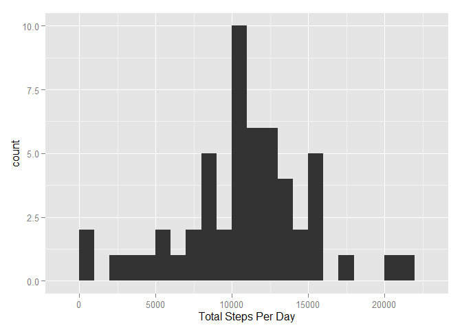
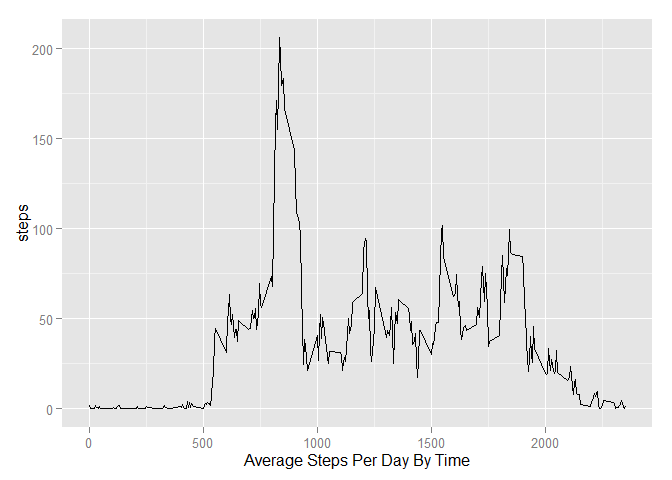
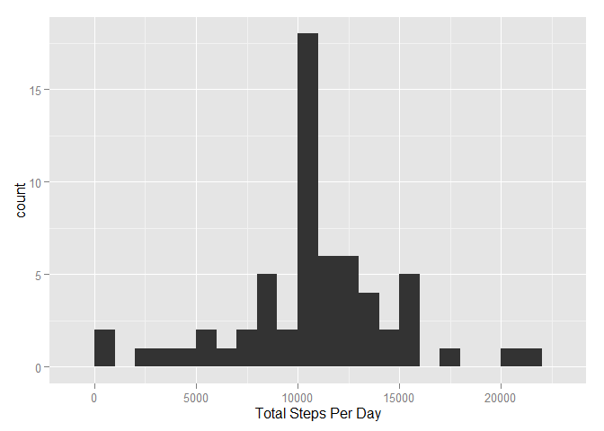
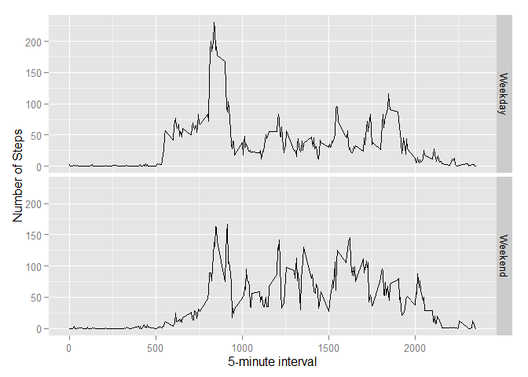

## Loading and preprocessing the data

```r
library(sqldf)
```

```
## Loading required package: gsubfn
## Loading required package: proto
## Loading required package: RSQLite
## Loading required package: DBI
```

```r
library(ggplot2)
setwd("C:/Alex/Coursera/Reproducible Data Research")
activity<- read.csv("activity.csv", header= TRUE)
str(activity)
```

```
## 'data.frame':	17568 obs. of  3 variables:
##  $ steps   : int  NA NA NA NA NA NA NA NA NA NA ...
##  $ date    : Factor w/ 61 levels "2012-10-01","2012-10-02",..: 1 1 1 1 1 1 1 1 1 1 ...
##  $ interval: int  0 5 10 15 20 25 30 35 40 45 ...
```

## What is mean total number of steps taken per day?

```r
stepsperday <- aggregate(steps ~ date, data = activity, FUN = sum)
qplot(x = steps, data = stepsperday, binwidth = 1000, xlab = "Total Steps Per Day")
```

 

```r
mean(stepsperday$steps)
```

```
## [1] 10766.19
```

```r
median(stepsperday$steps)
```

```
## [1] 10765
```


## What is the average daily activity pattern?

```r
int_avg <- aggregate(steps ~ interval, data = activity, FUN = mean)

int_avg$time <- ifelse((int_avg$interval < 10), paste("00",":","0",int_avg$interval,sep = ""), 
                       ifelse((int_avg$interval >= 10) & (int_avg$interval <100),paste("00",":",int_avg$interval, sep = ""),
                              ifelse((int_avg$interval >= 100) & (int_avg$interval <1000),paste("0",substr(int_avg$interval,1,1),":",substr(int_avg$interval,2,3), sep = ""),
                                     ifelse((int_avg$interval >= 1000), paste(substr(int_avg$interval,1,2),":",substr(int_avg$interval,3,4),sep = ""),"NA"))))
```

###Histogram of the Total Steps per Day by Time Interval

```r
qplot(x = interval, y = steps, data = int_avg, geom = "line", xlab = "Average Steps Per Day By Time")
```

 

###Max Steps per Day

```r
int_avg[int_avg$steps == max(int_avg$steps),]
```

```
##     interval    steps  time
## 104      835 206.1698 08:35
```

## Imputing missing values

```r
#There are many observations which have currently have missing values.#
#Here we replace them (imputation) with the average values for that interval, which is calculated above.#
nrow(activity[activity$steps == "NA",])
```

```
## [1] 2304
```

```r
activity_imp <- activity
activity_imp <- sqldf("SELECT a.*, b.steps as imp_steps FROM activity_imp a LEFT JOIN int_avg b USING(interval)")
```

```
## Loading required package: tcltk
```

```r
activity_imp$steps <- ifelse(is.na(activity_imp$steps),activity_imp$imp_steps, activity_imp$steps)
```


###Histogram of Steps Per Day with Imputed Data

```r
stepsperday_imp <- aggregate(steps ~ date, data = activity_imp, FUN = sum)
qplot(x = steps, data = stepsperday_imp, binwidth = 1000, xlab = "Total Steps Per Day")
```

 

###Mean and Median of Imputed Data

```r
mean(stepsperday_imp$steps)
```

```
## [1] 10766.19
```

```r
median(stepsperday_imp$steps)
```

```
## [1] 10766.19
```

```r
#Note that the mean does not change, because NA values were disregarded in the original data.# 
#Those NAs have been replaced with the interval-based means so the overall mean remains the same.#

#However, the median is higher, because NA values have now been replaced by actual values.#
```

## Are there differences in activity patterns between weekdays and weekends?

```r
# Marking each day as weekend or weekday#
activity_imp$day <- weekdays(as.Date(activity_imp$date))
activity_imp$weekday <- ifelse((activity_imp$day == "Saturday" | activity_imp$day == "Sunday"),"Weekend","Weekday")

#Average Steps Per Interval - Weekday/Weekend#
activity_imp$steps <- round(activity_imp$steps, digits = 2)
week_avg <- aggregate(steps~interval + weekday, data = activity_imp, FUN = mean)
```

###Plot By Weekday/Weekend#

```r
ggplot(week_avg, aes(interval, steps)) + geom_line() + facet_grid(weekday ~ .) + xlab("5-minute interval") + ylab("Number of Steps")
```

 
